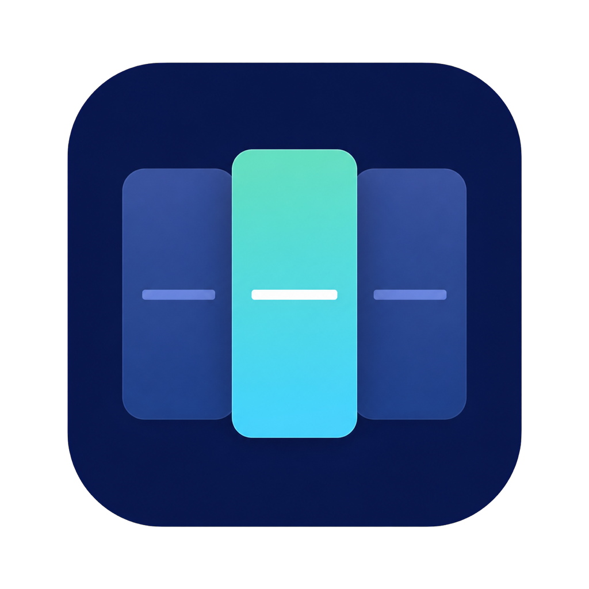

<p align="center">
  
</p>

<h1 align="center">FocusTrace</h1>

<p align="center">
  macOS 本地专注记录与训练工具
</p>

FocusTrace 不把“切了多少次应用”直接解释成分心。它把工作中容易混在一起的三件事分开：前台应用切换、真正的工作流切换，以及只有你才能确认的非必要偏离。

它主要提供：

- 按时间轴查看应用与工作流切换；
- 将 macOS Space 绑定到不同工作流；
- 在 Agent 等待时保存返回线索；
- 进行本地专注训练并比较前后效果。

## 一分钟开始

环境要求：macOS 14 或更高版本、Apple Silicon、Swift 6 Command Line Tools。

```bash
git clone https://github.com/cornliu26/FocusTrace.git
cd FocusTrace
./Scripts/deploy-mac.sh
```

部署脚本会依次执行测试、Release 构建、本地签名、暂存安装、签名校验、平滑重启与失败回滚。应用安装在：

```text
~/Applications/FocusTrace.app
```

已有活动数据和偏好设置会保留。Finder 用户也可以双击根目录的 `Deploy-FocusTrace.command`；它只是同一部署脚本的薄封装。

> FocusTrace 是菜单栏应用。第一次打开只需要输入一个信息：当前桌面的工作流名称。

## 日常怎么用

1. **一个桌面对应一个工作流。** 第一次绑定后，切换 macOS Space 就是切换工作流。
2. **平时直接工作。** 应用切换只是轨迹，不会自动被判定成走神。
3. **想训练时再点“开始专注”。** 必要工具切换不会让训练失败。
4. **Agent 等待时先挂起。** 写一句回来后的第一步，然后切到另一个桌面。
5. **下班后再看回顾。** 不需要在工作时一直盯着仪表盘。

菜单栏与主窗口始终由同一个 `FlowGuidanceEngine` 给出当前唯一的主要下一步。

## 核心能力

| 模块 | FocusTrace 做什么 | 刻意不做什么 |
| --- | --- | --- |
| 工作流识别 | 将稳定 Space 身份绑定到工作流，切桌面自动恢复上下文 | 不用窗口位置或桌面序号猜测 |
| 应用轨迹 | 记录前台应用、起止时间、锁屏、睡眠与唤醒 | 不读取窗口标题、网页地址或输入内容 |
| 专注训练 | 静默基线、倒计时、必要工具集合、渐进时长 | 不因合理工具切换判定失败 |
| 专注护栏 | 5 分钟进度反馈；频繁且稳定的工作流切换才提示 | 不把原始 Space 事件直接当作分心 |
| Agent 挂起 | 保存本地恢复线索并统计返回耗时 | 不把恢复文字写入日报 |
| 本地分析 | 归一化每小时指标、近 7 日趋势、单项训练与次日验证 | 不使用黑盒 ADHD 评分 |
| 数据管理 | JSON/CSV 导出、保留期、按日删除与全部清空 | 不上传云端，不建立账号 |

## 分析闭环

FocusTrace 先检查记录质量，再比较每小时指标与近 7 日基线。训练完成后记录完成情况和主观难度，并在下一工作日验证效果。

数据不足时，FocusTrace 会明确说“现在不能判断注意力”，并优先修复工作流归因或 Space 识别。正式阶段 2 计划调整仍需至少 **10 个工作日 + 20 次训练**；每个计划版本至少运行 5 次训练，且只有用户确认后才会生效。

## 隐私设计

所有行为数据只保存在本机：

```text
~/Library/Application Support/FocusTrace/store.json
```

FocusTrace：

- 只保存应用名称、Bundle ID、时间、工作流标签和训练反馈；
- 不读取窗口标题、URL、聊天对象、键盘内容或手机行为；
- 不需要辅助功能、屏幕录制或输入监控权限；
- 只有在你明确开启时才注册登录项；
- 不自动修改训练计划、允许应用、通知设置或其他偏好。

写入采用 250ms 合并与原子替换。异常退出后，未闭合片段最多恢复为 5 分钟，避免生成无限时长记录。

## Codex 每日回顾

无需单独开发 API。运行：

```bash
./Scripts/generate-daily-report.sh
```

脚本生成两个仅含聚合结果的文件：

```text
.focustrace/reports/latest.json
.focustrace/reports/latest.md
```

Codex 定时任务以 `latest.json` 的 `schemaVersion` 协议为事实源，并只读取这两个文件。报告不包含原始活动行、Bundle ID、事件 ID、窗口标题、URL、输入内容或工作流恢复文字。

## 构建与验证

```bash
./Scripts/test.sh
./Scripts/build-app.sh
./Scripts/run-space-acceptance.sh  # 可选：三桌面真实切换验收
```

- `test.sh` 编译并运行 Swift Testing 与独立 `FocusTraceVerification`。
- `build-app.sh` 生成带应用图标、本地签名的 `dist/FocusTrace.app`，但不负责日常安装。
- `run-space-acceptance.sh` 使用进程内临时绑定验证真实 Space 切换，不读写正式 FocusTrace 数据。

## 发布与自动更新

每个 `vX.Y.Z` 标签会触发 GitHub Actions：运行完整测试、构建 Apple Silicon
应用、生成带 SHA-256 的 `latest.json`，并发布 GitHub Release。应用默认每天检查
一次该公开清单；发现新版后只提示，由你点击“安装并重启”才会替换应用包。

发布前让 `Packaging/Info.plist` 的版本与标签一致，然后：

```bash
git tag v0.2.0
git push origin v0.2.0
```

更新只替换当前 `FocusTrace.app`，不会改动
`~/Library/Application Support/FocusTrace` 或偏好设置；替换前会校验来源 URL、
文件大小、SHA-256、Bundle ID、版本与代码签名，失败时回滚旧应用。

当前版本使用 Codable 原子快照存储，因为纯 Command Line Tools 缺少 `SwiftDataMacros`。领域模型与 UI 不依赖具体存储实现，安装完整 Xcode 后可以迁移到 SwiftData 后端。

<details>
<summary><strong>工程结构</strong></summary>

- `Sources/FocusTraceCore`：纯 Foundation 领域模型、状态机、指标、训练与分析规则。
- `Sources/FocusTraceMacSupport`：稳定 Space 身份解析与按显示器隔离的绑定。
- `Sources/FocusTrace`：AppKit/SwiftUI 采集、本地存储、通知、菜单栏与界面。
- `Sources/FocusTraceReport`：为 Codex 生成隐私收敛后的本地聚合日报。
- `Sources/FocusTraceVerification`：在 Command Line Tools 环境中执行验收检查。
- `Sources/FocusTraceSpaceAcceptance`：不污染正式数据的真实桌面切换验收工具。
- `Packaging`、`Assets` 与 `Scripts`：图标、应用包组装、签名、部署与回滚。

桌面工作流的身份边界和生命周期见 [WORKFLOW_SPACES_DESIGN.md](./Docs/WORKFLOW_SPACES_DESIGN.md)。

</details>

<details>
<summary><strong>关于 macOS Space 的实现边界</strong></summary>

macOS 公开 API 不提供稳定 Space ID。FocusTrace 动态读取 SkyLight 的 `(display UUID, managed Space ID/UUID)`，但不读取窗口内容。SkyLight 属于未公开系统接口，可能随 macOS 更新变化；读取失败时应用会进入“未知”并停止归因，不会回退到猜测。这个实现适合本地自用与 ad-hoc 签名构建，不承诺 Mac App Store 兼容性。

</details>

## 参与贡献

欢迎提交 issue 和 pull request。开始前请阅读 [CONTRIBUTING.md](./CONTRIBUTING.md)，尤其是其中的隐私边界。任何报告、真实活动数据或 `~/Library/Application Support/FocusTrace` 下的文件都不应进入提交。

## 医疗边界

FocusTrace 是工作行为记录与专注习惯训练工具，不诊断或治疗 ADHD。应用或工作流切换频繁不能证明存在 ADHD；如果注意力问题持续在多个场景造成明显影响，应寻求具备资质的专业评估。

---

<p align="center">
  <sub>Local-first · Explainable · User-controlled</sub>
</p>
