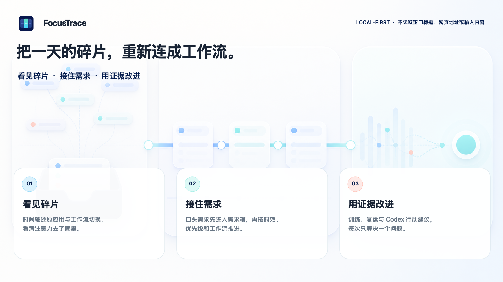

<p align="center">
  
</p>

<p align="center">
  
  
  
</p>

<p align="center">
  <a href="https://github.com/cornliu26/FocusTrace/releases/latest"><strong>下载 FocusTrace</strong></a>
  ·
  <a href="#30-秒上手">快速上手</a>
  ·
  <a href="./Docs/GETTING_STARTED.md">新手教学</a>
  ·
  <a href="#重要特性">重要特性</a>
  ·
  <a href="#高级特性">高级特性</a>
  ·
  <a href="https://github.com/cornliu26/FocusTrace/issues/new/choose">反馈问题</a>
</p>

---

## 安装

> [!IMPORTANT]
> 当前版本支持 **macOS 14 或更高版本**，以及 **Apple Silicon Mac**。

1. 打开 [最新版本下载页](https://github.com/cornliu26/FocusTrace/releases/latest)。
2. 下载 `FocusTrace-macOS-arm64.zip` 并解压。
3. 将 `FocusTrace.app` 拖进“应用程序”文件夹。
4. 第一次启动时，如果 macOS 提示无法验证开发者，请右键应用并选择“打开”。

安装或重新安装都不会删除已有的工作轨迹和偏好。

<details>
<summary><strong>从源码一键安装</strong></summary>

需要 Swift 6 Command Line Tools：

```bash
git clone https://github.com/cornliu26/FocusTrace.git
cd FocusTrace
./Scripts/deploy-mac.sh
```

也可以在 Finder 中双击 `Deploy-FocusTrace.command`。

</details>

## 30 秒上手

| | 你要做什么 |
| --- | --- |
| **1 · 创建工作流** | 第一次打开只填写当前正在推进的事情，例如“排查登录问题”。 |
| **2 · 绑定工作桌面** | 切回真正工作的普通或全屏桌面，从屏幕顶部状态栏选择 FocusTrace，再绑定刚创建的工作流。 |
| **3 · 正常工作** | 可以关掉主窗口。工作时段会自动形成轨迹，合理的工具切换不会被武断地判定为分心。 |
| **4 · 下班再回顾** | 先用时间轴解释高切换区间，再在回顾分析里只选择一项可以验证的调整。 |

> [!TIP]
> 突然收到一个新需求时，先在菜单栏点“收下一个需求”。它不会打断或切换当前工作流。

第一次创建后，App 会继续显示绑定、记录和回顾三步，不会把你留在一个空白主界面。以后可以从状态栏的“更多 → 查看新手教学”重新打开。

**第一次使用或时间轴没有更新？** 查看 [完整新手教学](./Docs/GETTING_STARTED.md)。

## 重要特性

<p align="center">
  
</p>

| 日常最痛的事 | FocusTrace 怎样处理 |
| --- | --- |
| **忙了一天，却不知道是在推进还是只是在切屏** | **看清**：时间轴区分工具切换与工作流切换，只记录事实，不凭一次切屏判断分心。 |
| **Agent 等待、消息和口头需求插入后，原来的工作回不去** | **不丢**：需求先进入收件箱，准备做时只需选择处理或不处理；多条需求可以归入同一工作流，Space 与返回点保留原来的工作上下文。 |
| **知道注意力变差，却不知道怎样改善才适合自己** | **改善**：先建立个人基线，再一次调整一个训练变量，用后续数据验证是否有效。 |

所有数据默认只在本机。FocusTrace 不读取窗口标题、网页内容、输入内容、聊天对象或手机行为。

## 高级特性

### 保存返回点

等待 Agent、构建或测试，或被临时消息打断时，从状态栏保存“回来后第一步”再切走。回到这个桌面时，FocusTrace 会把下一步重新放到眼前，减少重新进入上下文的成本。它不读取或管理 Agent。

### 需求箱

临时需求先“收下”，不会自动创建、绑定或切换工作流。准备做时点击“处理”，它会进入已归属或当前工作流；没有明确上下文时才询问一次工作流。截止日期和重要程度可以在详情里补，多条需求可以归入同一工作流，完成其中一条不会结束工作流。

### 十日注意力趋势

回顾页固定呈现连续工作、碎片化、切换边界、恢复闭环和训练反应五个趋势。它比较最近 3 个可靠工作日与此前最多 7 日的个人典型区间；今天尚未结束时不绘制进趋势图，不会拿半天数据制造结论。

五个趋势不会被合成一个看似精确的“注意力分数”。只有恢复后果或多个维度的证据收敛时，FocusTrace 才指出一个主要问题；同一工作流内的工具协作不会被直接算作分心。

你可以把这个问题确认为一项短实验。实验只改变一个行为变量，固定工作流与时段等比较条件；只有实际完成对应专注轮次或保存返回点才进入比较，并分别显示可靠样本、没有实验机会、未执行或缺少反馈、质量阻断。日维度实验固定首个 10 个完整工作日为证据窗口，样本不足只会得出“证据不足”，不会硬猜改善或失败。实验完成或由你提前结束之前，App 与 Codex 都会延续同一项，不会每天换一条泛泛的新建议。

### 针对个人的训练调整

积累至少 **10 个工作日和 20 次训练** 后，FocusTrace 才会进入阶段 2。它每周最多建议一项变化，并说明证据；任何训练计划调整都需要你确认。

### Codex 每日行动复盘

在“回顾分析”中点击“在 Codex 中接入每日复盘”，即可建立本地聚合报告与 Codex 定时任务之间的连接，不需要 API key。

每天的写回只回答三件事：

1. **当前问题**：今天最值得处理的唯一阻塞；
2. **今天怎么做**：一个可以立即执行的动作；
3. **如何验收**：下一次检查的指标和目标。

选择过去的日期，也可以重新查看已经写回的历史复盘。

<details>
<summary><strong>Codex 会看到什么？</strong></summary>

Codex 只读取 FocusTrace 生成的本地聚合报告。有进行中实验时，它优先延续 App 已确认的问题、当天动作和验收条件；没有实验时，才从同一份十日趋势中选择一个主要问题。之后再用“起点工作流 → 最终工作流 × 切换原因”的聚合路线核对原因与恢复后果；有界的工作流与未完成需求标题只用于帮助区分计划性交接和真正需要改善的跳转。

标题只作为上下文标签，每个工作流最多带三个需求标题；报告不会包含需求来源、期望产出、UUID、逐次切换时间、原始活动行、Bundle ID、窗口标题、URL、输入内容或 Agent 返回点文字。

数据不足或工作流归因不可靠时，Codex 只能指出一个数据问题和修复动作，不能据此评价注意力。写回还会拒绝重复证据、空泛总结和无关的阶段解锁进度。

连接流程会打开 Codex 并预填设置说明，最后一次发送仍由你确认。文件桥只在首次连接或路径失效后重新连接时登记一次；每日复盘只更新已授权工作区内的聚合报告，不应反复索要写入权限。即使不接入 Codex，时间轴、本地分析和训练也会正常工作。

</details>

### 切换负荷实践

FocusTrace 不生成“脑负荷分数”。它只在个人基线、切换后的恢复成本和主观难度至少两类证据收敛时，指出一项值得验证的切换问题。研究依据、全部 trace 的用途和一周实践方法见 [《从“切了多少次”到“这次切换是否值得”》](./Docs/SWITCHING_LOAD_PRACTICE.md)。

## 反馈问题

在 GitHub 的 [反馈入口](https://github.com/cornliu26/FocusTrace/issues/new/choose) 选择“问题反馈”即可，不需要单独的反馈账号或后台服务。

如果软件更新失败，“设置与数据 → 软件更新”会显示“报告更新问题”。它只会预填 FocusTrace 版本、macOS 版本、失败阶段和错误代码；不会上传活动记录、工作流名称、需求内容或应用使用数据。最终提交前，你仍可以检查和修改全部内容。

如果旧版本在更新后没有重新打开，请从 [最新版本页](https://github.com/cornliu26/FocusTrace/releases/latest) 手动覆盖安装一次；之后的版本会在失败时保留并重新打开旧版。

## 隐私边界

- 只记录前台应用、起止时间、工作流标签和训练反馈。
- 不读取窗口标题、网页地址、聊天对象、键盘内容或手机行为。
- 不需要辅助功能、屏幕录制或输入监控权限。
- 需求来源、期望产出和 Agent 返回点仅保存在本机；聚合日报最多只带每个工作流三个未完成需求标题作为上下文标签。
- 不自动修改训练计划、允许应用、系统通知或其他偏好。

<details>
<summary><strong>本地数据与技术边界</strong></summary>

数据保存在：

```text
~/Library/Application Support/FocusTrace/store.json
```

macOS 没有公开稳定的 Space ID。FocusTrace 读取系统的 Space 身份，但不读取窗口内容；无法可靠识别时会停止归因，而不是猜测当前工作流。

更完整的设计说明见 [WORKFLOW_SPACES_DESIGN.md](./Docs/WORKFLOW_SPACES_DESIGN.md)。

</details>

<details>
<summary><strong>开发、测试与贡献</strong></summary>

```bash
./Scripts/test.sh
./Scripts/build-app.sh
./Scripts/run-space-acceptance.sh
```

- `FocusTraceCore`：行为模型、训练与分析规则。
- `FocusTraceMacSupport`：Space 身份与工作流绑定。
- `FocusTrace`：macOS 菜单栏应用与本地界面。

欢迎提交 issue 和 pull request。开始前请阅读 [产品纲领](./Docs/PRODUCT_DOCTRINE.md)、[质量门禁](./Docs/QUALITY_GATES.md) 和 [CONTRIBUTING.md](./CONTRIBUTING.md)，不要提交真实活动数据或本地生成的报告。

</details>

## 说明

FocusTrace 是工作行为记录与专注习惯训练工具，不诊断或治疗 ADHD。如果注意力问题持续在多个场景造成明显影响，请寻求具备资质的专业评估。

---

<p align="center">
  <sub>Local-first · Explainable · User-controlled</sub>
</p>
